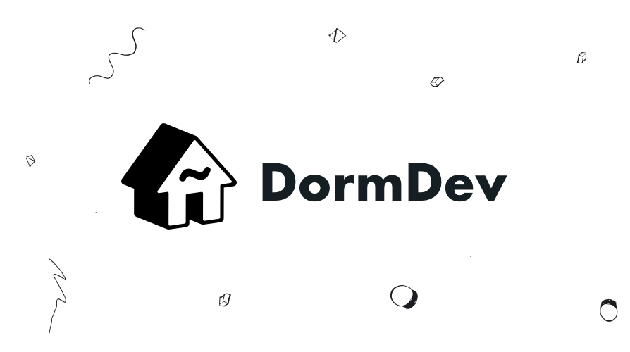

<!-- Banner Image -->

  
  
  
    
  

---

The DormDev website, built with [Next.js](https://github.com/zeit/next.js), is an open-source initative to help students get involved in modern technology online.

_more coming soon!_
